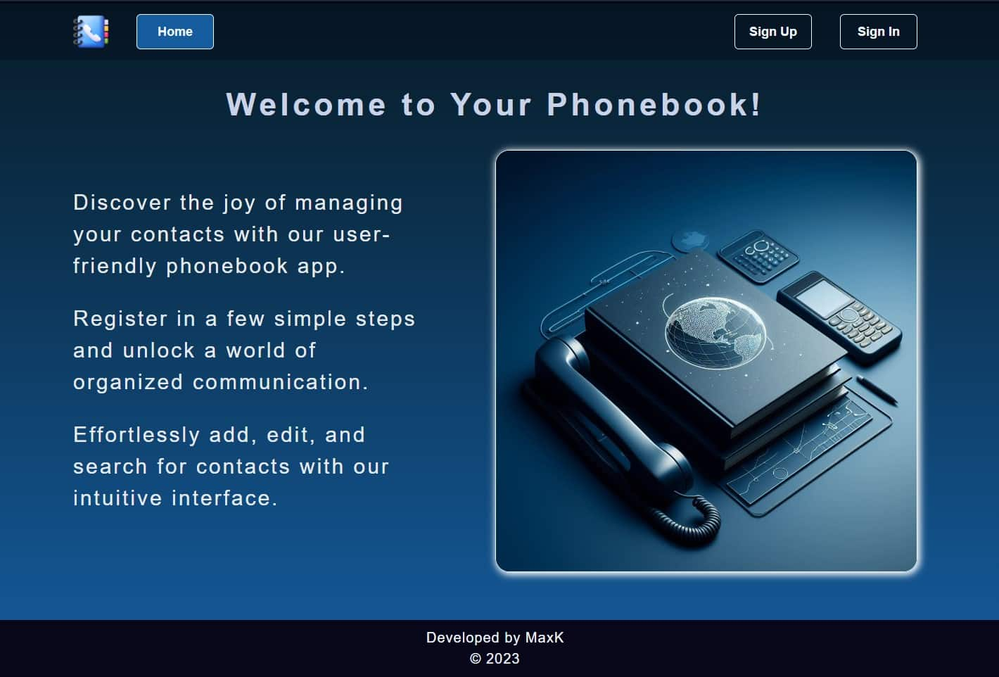
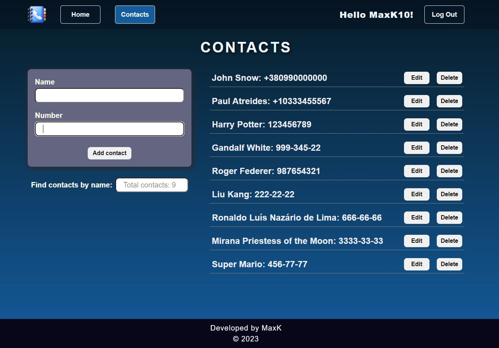

# Phonebook App

This is a simple React.js Phonebook App with various features for managing
contacts. The app is designed to be responsive, offering a seamless experience
on different devices. Below is an overview of the features and the structure of
the app.

## Screenshots

#### Home Page

#### Contacts Page

## Features

- **Pages**:

  - Home: Introduces the app and its benefits.
  - Contacts: Displays a list of contacts, allows creation, deletion, and
    editing of contacts. Includes a filter input to search for contacts by name.
  - Login: User authentication page.
  - Register: User registration page.
  - NotFound: Displays a 404 page for non-existing routes.

- **Validation**:

  - Email and password validation on the login and register pages.
  - Contact creation form includes validation for contact information.

- **Backend**:

  - Utilizes a public backend that supports contact collection operations, user
    registration, login, and updates using JWT authentication.
  - For detailed API documentation, read the
    [documentation](https://connections-api.herokuapp.com/docs/).

- **Layouts**:

  - Responsive design for mobile, tablet, and desktop layouts.

- **Redux**:

  - Global state management using Redux for efficient data flow.

- **Persist**:

  - Implements data persistence to save JWT tokens for seamless user experience.

- **Public and Private Routes**:

  - Configured public and private routes to control access to pages. For
    example, only registered users can access the Contacts page.

- **Code Splitting and Lazy Loading**:

  - Optimize performance by implementing code splitting and lazy loading for
    pages. Only load the necessary code chunks when required, enhancing the
    overall user experience.

- **User Actions**:

  - Provides notifications for different user actions, enhancing user
    experience.

### Getting Started

1. Clone the repository.
2. Install dependencies: npm install.
3. Run the app: npm start.

Make sure to replace the public backend URL with your backend URL if needed.

### Usage

1. **Home Page**:

   - Describes the benefits and features of the app.

2. **Contacts Page**:

   - Displays a list of contacts.
   - Create, edit, and delete contacts.
   - Filter contacts by name.

3. **Login Page**:

   - Authenticate with your email and password.

4. **Register Page**:

   - Create a new user account.

5. **NotFound Page**:

   - Displays a 404 page for non-existing routes.

### Technologies Used

- React.js
- Redux
- React Router
- JWT Authentication
- Responsive Design
- Notification Library

### Acknowledgments

Special thanks to the developers of the public backend used in this app!

Feel free to explore and customize the app according to your needs!
